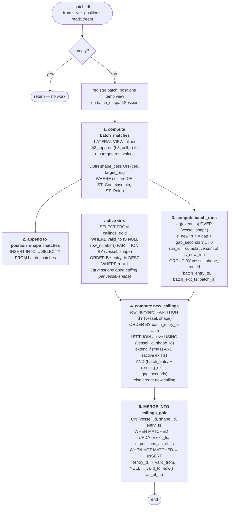

# MarineIntel Vessel-Callings Demo

A Databricks Asset Bundle implementing the streaming vessel-callings architecture
from the AR-000117956 research brief: H3-indexed shapes via `h3_tessellateaswkb`,
position-side ancestor expansion via `h3_toparent`, equi-join on `(cell, target_res)`,
chip-refined `ST_Contains` on boundary cells, and a streaming foreachBatch MERGE
into a bitemporal `callings_gold` table.

See [`BRIEF.md`](./BRIEF.md) for the full design rationale, decisions log, and
discovery context. This README is the deploy-and-run runbook.

---

## What the demo shows

1. **The chip-pattern join in motion.** Each micro-batch reports the
   `core` (fast-path) vs boundary (chip-refined `ST_Contains`) split.
2. **Concentric multi-resolution callings.** A vessel transiting the Dover
   Strait simultaneously triggers callings against the Dover TSS Lane (res 8),
   the British EEZ (res 5), and the North Atlantic Ocean (res 2) — three
   nested resolutions, one MERGE.
3. **Streaming throughput.** Sustained ~1 000 records/second end-to-end on
   a 2-worker Photon cluster (Standard_D4ds_v5).
4. **Late-arrival correctness.** A configurable percentage of generator
   records are emitted with delayed `ingest_ts`. The MERGE's
   cross-batch-continuation logic still produces the right calling intervals.

---

## Architecture (current state)

```
   src/generator/ (Python)                  ← deterministic from `seed`
         │
         ▼ direct append (Spark write)
   bronze_ais_positions  (Delta, TIMESTAMP event_ts)
         │
         ▼ streaming readStream + h3_longlatash3 enrichment
   silver_positions  (Liquid Cluster on (h3_cell, event_ts), watermark 6h)
         │
         ▼ streaming foreachBatch every `merge_trigger_seconds`
         │     1. inline-explode through h3_toparent at every distinct target_res
         │     2. equi-join shape_cells on (cell, target_res)
         │     3. chip-refine on core = FALSE
         │     4. within-batch presence runs (lag + cumulative gap sum)
         │     5. cross-batch run continuation (extend if gap < threshold)
         │     6. MERGE INTO callings_gold (bitemporal)
         ▼
   callings_gold  (vessel_id, shape_id, entry_ts, exit_ts, valid_from, valid_to, as_of_ts)

   Static reference, built once at bootstrap:
     shapes_raw   ← 3 parquet files in data/
     shape_cells  ← h3_tessellateaswkb(ST_AsBinary(geom), target_res), Liquid Cluster on (cell)
```

---

## How the streaming MERGE works

The heart of the demo is the `foreachBatch` callable in
[`notebooks/30_callings/stream_callings.py`](./notebooks/30_callings/stream_callings.py).
Each micro-batch of new `silver_positions` rows is run through the five
transformations below, then upserted into `callings_gold`.



### Step 1 — compute `batch_matches`

Every new position is ancestor-walked through `h3_toparent` at each
**distinct** `target_res` present in `shape_cells` (computed once at
notebook startup). The result is equi-joined to `shape_cells` on
`(cell, target_res)` — Spark's cheapest join, on BIGINT keys. Boundary
cells (where `core = FALSE`) get a chip-refined `ST_Contains` check
against the per-cell `chip_wkb`; core cells take the fast path.

```sql
LATERAL VIEW inline(array(
  named_struct('ancestor_cell', h3_toparent(h3_cell, 2), 'res', 2),
  named_struct('ancestor_cell', h3_toparent(h3_cell, 5), 'res', 5),
  ...
)) a
JOIN shape_cells sc
  ON sc.cell = a.ancestor_cell AND sc.target_res = a.res
WHERE sc.core
   OR ST_Contains(ST_GeomFromWKB(sc.chip_wkb, 4326),
                  ST_Point(lon, lat, 4326))
```

### Step 2 — append matches to `position_shape_matches`

Every batch's matches are appended to a long-form audit table tagged
with `batch_id`. This isn't required for callings to work, but is
invaluable for debugging the join (core/boundary ratios, per-shape
match counts, vessel hot-cell analysis).

### Step 3 — compute `batch_runs`

A vessel's matches against a given shape can span many position
emissions. We collapse them into **presence runs**: contiguous matches
where the gap between consecutive `event_ts` values stays under
`gap_seconds`. The classic window-function gap-detection trick:

```sql
lag(event_ts) OVER (PARTITION BY vessel_id, shape_id ORDER BY event_ts)
→ is_new_run = (gap > gap_seconds) ? 1 : 0
→ run_id = sum(is_new_run) OVER ...   -- cumulative sum
→ GROUP BY vessel_id, shape_id, run_id
```

The result is one row per `(vessel_id, shape_id, run_id)` with
`batch_entry_ts`, `batch_exit_ts`, and `batch_n` (the position count).

### Step 4 — cross-batch continuation in `new_callings`

If a calling started in a previous batch and the current batch picks
up matches within `gap_seconds` of its `exit_ts`, we want to **extend
the existing calling** rather than create a new one. The `active`
view holds the most-recent open calling per `(vessel, shape)` — the
`row_number() … WHERE rn = 1` filter is essential here, because a
vessel can have multiple historical callings to the same shape (and
all of them have `valid_to IS NULL` until a shape mutation supersedes
them). Without the filter, the LEFT JOIN multiplies source rows and
the MERGE fails with `DELTA_MULTIPLE_SOURCE_ROW_MATCHING_TARGET_ROW_IN_MERGE`.

Only the **earliest** run per `(vessel, shape)` in the batch (`rn = 1`)
is allowed to extend — subsequent runs in the same batch become new
callings within that batch.

```sql
CASE
  WHEN rn = 1
   AND existing_entry_ts IS NOT NULL
   AND unix_timestamp(batch_entry_ts) - unix_timestamp(existing_exit_ts) <= gap_seconds
  THEN existing_entry_ts          -- extension: keep the existing entry_ts
  ELSE batch_entry_ts             -- new calling: own entry_ts
END AS entry_ts
```

### Step 5 — idempotent MERGE INTO `callings_gold`

The MERGE keys on `(vessel_id, shape_id, entry_ts)`. Extensions match
an existing row and UPDATE its `exit_ts`, `n_positions`, and
`as_of_ts`. New callings INSERT with `valid_from = entry_ts`,
`valid_to = NULL`, `as_of_ts = current_timestamp()`. The MERGE is
idempotent — re-processing the same batch produces the same end
state (`as_of_ts` ticks forward but nothing else changes).

### Gotchas worth remembering

- **`batch_df.sparkSession` vs the notebook's `spark`** are different
  sessions in `foreachBatch` context. Temp views created on one are
  invisible to the other. The code routes everything through
  `s = batch_df.sparkSession` consistently. Forgetting this fails
  with `TABLE_OR_VIEW_NOT_FOUND` on the first SQL call.
- **At most one open calling per (vessel, shape)** is an invariant
  the MERGE preserves once running, but a `row_number()` filter in
  the `active` view enforces it defensively at every batch.
- **`reset_state=true`** drops `position_shape_matches` and
  `callings_gold` and clears the streaming checkpoint. The streaming
  source (`silver_positions`) is untouched, so the next start
  re-derives everything from offset 0.

---

## Prerequisites

- **Databricks workspace** on Azure with Unity Catalog and a DBR 18.2+
  cluster running **Photon** (Spatial SQL `ST_*` and `h3_*` family is GA
  from 18.3 — works on 18.2.x with the spatial expressions enabled).
- **Permissions** in the workspace for the deploying user:
  - `USE CATALOG` + `CREATE SCHEMA` on the target catalog.
  - `MANAGE` on the target schema (we create schema, volume, tables).
  - Attach permission on the dev cluster.
- **Local toolchain**:
  - Databricks CLI ≥ 0.215 (with the bundles subcommand).
  - Python 3.11+ for the local `.venv`.
  - `uv` for compiling the lock file (added to the venv automatically).

---

## Configure for the target environment

Two files hold all the per-environment configuration:

### 1. `databricks.yml` — bundle variables

Edit the `variables:` block to match the target environment:

| Variable | Default (Stuart's dev) | What to set in customer env |
|---|---|---|
| `catalog` | `stuart` | A UC catalog you own |
| `schema` | `marineintel` | A schema in that catalog |
| `volume` | `landing` | UC volume name (we create it) |
| `cluster_id` | `0519-163942-gq1rcl9r` | ID of your dev cluster |
| `n_vessels` | `500` | Fleet size; 100–2 000 is comfortable on 2 workers |
| `sim_speedup` | `60` | Sim-time : wall-time ratio (60× = 1 sim-hour per wall-minute) |
| `position_res` | `8` | Finest `target_res` in shape_cells |
| `merge_trigger_seconds` | `30` | Streaming MERGE cadence (both v1 and v2) |
| `gap_minutes` | `5` | Gap above which a new calling starts — **v1 MVP only** |
| `retraction_window_days` | `7` | Per-vessel lookback cap for the v2 gaps-and-islands derivation |
| `max_runtime_minutes` | `240` | Wall-clock cap on the generator |
| `reset_state` | `false` | Flip to `true` on first run of a fresh demo |

And the `targets.dev.workspace.host:` URL to the target workspace.

### 2. CLI profile in `~/.databrickscfg`

```ini
[<profile>]    # name it whatever fits the customer environment
host = https://<your-workspace>.azuredatabricks.net
```

Authenticate once:

```bash
databricks auth login --profile <profile>
```

Then every bundle command takes `-p <profile>`.

### 3. The dev cluster

This bundle uses an **existing** all-purpose cluster (`${var.cluster_id}`) rather
than spinning up job clusters per-task — saves several minutes of cold-start per
iteration. The cluster needs:

- DBR **18.2.x-scala2.13** (or newer)
- Runtime engine **PHOTON**
- `data_security_mode = SINGLE_USER` (dedicated)
- ≥ 2 workers; `Standard_D4ds_v5` works comfortably for the demo's scale

A reference spec is committed at [`infra/cluster.json`](./infra/cluster.json).
To clone an existing one:

```bash
databricks clusters create --json @infra/cluster.json -p <profile>
```

Then put its ID into `var.cluster_id` in `databricks.yml`.

---

## Deploy

```bash
# 1. Lock the deps if you haven't already (.venv contains uv)
.venv/bin/uv pip compile requirements.txt -o requirements.lock

# 2. Validate (catches yaml typos before round-tripping the workspace)
databricks bundle validate -t dev -p <profile>

# 3. Deploy
databricks bundle deploy -t dev -p <profile>
```

After this you'll see ten jobs in the workspace prefixed `[marineintel-demo]`:

| Job key | Notebook | Mode |
|---|---|---|
| `bootstrap` | copy_shape_files + load_shapes | one-shot |
| `shape_index` | pick_target_res + build_shape_cells | one-shot |
| `position_generate` | generate_ais (direct-to-bronze Delta writer) | long-running |
| `position_index` | index_positions (bronze → silver streaming) | streaming |
| `callings_merge` | stream_callings — gap-threshold heuristic (MVP) | streaming |
| `callings_merge_v2` | stream_callings_v2 — gaps-and-islands derivation (production design per BRIEF.md §5.1) | streaming |
| `shape_mutation_replay` | replay_shape_change (stub) | on-demand |
| `truncate_callings` | truncate_callings (one-shot: clears callings_gold + position_shape_matches without touching schema or checkpoints) | one-shot |
| `reset_streaming_state` | reset_streaming_state (drops all four streaming tables + checkpoints) | one-shot |
| `check_status` | check_status (row counts + event_ts freshness probe) | one-shot |

**Pick one callings stream, not both** — `callings_merge` and `callings_merge_v2`
write to the same `callings_gold` table with incompatible schemas. The MVP keeps
`callings_merge` for the original walk-through. `callings_merge_v2` is the
recommended production design and what subsequent customer iterations should
build on.

The schema, volume, and `data/` files are uploaded as bundle artifacts.

---

## Run order (fresh demo)

```bash
# 0. Reset everything from any prior run (drops streaming tables + checkpoints)
databricks bundle run reset_streaming_state -t dev -p <profile>

# 1. Bootstrap — copy shape parquets into the volume, load shapes_raw
databricks bundle run bootstrap -t dev -p <profile>

# 2. Shape index — build shape_cells (~10 min for 452 shapes / 530k cells)
databricks bundle run shape_index -t dev -p <profile>

# 3. Start the three streaming jobs in this order, each in background:

#    a. Generator first — gives the indexer files to chew on
databricks bundle run position_generate -t dev -p <profile> --no-wait

#    b. Position indexer — bronze → silver streaming
sleep 30  # let bronze get its first rows
databricks bundle run position_index -t dev -p <profile> --no-wait

#    c. Callings stream — silver → callings_gold via foreachBatch MERGE
#       Pick one: `callings_merge` (v1 MVP, gap-threshold) or `callings_merge_v2`
#       (production gaps-and-islands design, see BRIEF.md §5.1).
sleep 30
databricks bundle run callings_merge_v2 -t dev -p <profile> --no-wait

# 4. Watch progress
databricks bundle run check_status -t dev -p <profile>
```

`check_status` returns a JSON summary of row counts and event-time ranges
across `bronze_ais_positions`, `silver_positions`, `position_shape_matches`,
and `callings_gold`. Run it repeatedly during the demo to show live growth.

---

## Watch the streams in the UI

The Databricks workspace Spark UI on the dev cluster has a **Streaming**
tab that shows each active streaming query, its trigger cadence, input/output
rates, and per-batch durations. Open this on a second monitor during the
demo — it's the most convincing "this is actually streaming" visual.

URL:
`<workspace_host>/#setting/clusters/<cluster_id>/sparkUi → Streaming`

---

## Visualise

Two folium-via-geopandas notebooks live in `notebooks/90_validation/`:

- `explore_shape_cells.py` — renders shape outlines plus their H3 cell
  coverage (interior cells blue, boundary cells orange). Sanity check that
  the tessellation produced what you expect.
- `explore_positions.py` — renders vessel tracks coloured by `vessel_type`
  on top of the NOAA shipping-lanes backdrop. Configurable bounding box
  and simplification tolerance keep the folium HTML small enough to render
  in a single notebook cell.

Open either notebook in the workspace, attach to the dev cluster, and run
from the top.

---

## Stop everything

```bash
# Cancel all active marineintel-demo runs
databricks jobs list-runs -p <profile> --active-only -o json | python3 -c "
import sys, json
for r in json.load(sys.stdin):
    if 'marineintel-demo' in (r.get('run_name','') or ''):
        print(r.get('run_id'))" | xargs -I{} databricks jobs cancel-run {} -p <profile>
```

`position_generate` self-terminates at `max_runtime_minutes`. The two
streaming jobs run indefinitely until cancelled.

To wipe all generated state and keep only the static `shapes_raw` /
`shape_cells`:

```bash
databricks bundle run reset_streaming_state -t dev -p <profile>
```

To remove **everything** including shapes and the bundle's UC objects:

```bash
databricks bundle destroy -t dev -p <profile>
```

This deletes the schema, volume, and all the streaming tables. The static
`stuart` catalog (or whatever you set `var.catalog` to) is untouched.

---

## Known limitations / quirks

- **Generator throughput** is ~1 k records/sec on the dev cluster with the
  default 500 vessels × 60× speedup. To push higher, raise `sim_speedup`
  before raising `n_vessels` — the bottleneck is `spark.createDataFrame`
  overhead per flush, not the tick logic itself.
- **Auto-quarantine threshold** (`var.quarantine_wkb_bytes`, default
  500 KB) excludes 3 shapes from `shape_cells`: Shetland ATBA, Canadian
  EEZ, Russian EEZ. None are central to the UK QBR storyline. Raise the
  threshold to include them, at the cost of longer `build_shape_cells`
  run-time.
- **Antimeridian crossers** (12 shapes — 4 Pacific oceans + 8 Pacific
  island EEZs) are filtered upstream of tessellation by the
  `tessellation_safe` flag. Splitting them at longitude 180° is a known
  follow-up.
- **`reset_state=true`** must be flipped to `false` on subsequent restarts
  of `position_index` / `callings_merge*`, or each restart will wipe the
  in-flight streaming state.
- **v1 vs v2 schema mismatch**: `callings_merge` (gap-threshold) and
  `callings_merge_v2` (gaps-and-islands) write incompatible schemas to
  the same `callings_gold` table. Don't run both. The v2 design is the
  recommended target — see BRIEF.md §5.1.
- **`catalogManaged` Delta feature** is required on `silver_positions`
  and `callings_gold` for v2's `BEGIN ATOMIC` transactions. Both
  notebooks set the TBLPROPERTY at create-time and re-apply via
  `ALTER TABLE ... SET TBLPROPERTIES` defensively on each start.
- **`ignoreDeletes = true`** is set on both `position_index`'s and
  `callings_merge_v2`'s `readStream`. Without it, a `TRUNCATE` on
  `bronze_ais_positions` or `silver_positions` (e.g. via the
  `truncate_callings` job) crashes the downstream streaming query
  with `DELTA_SOURCE_IGNORE_DELETE` on the next batch.

---

## Project layout

```
marineintel-demo/
├── README.md                      ← this file
├── BRIEF.md                       ← design rationale + decisions log
├── databricks.yml                 ← bundle root: variables, targets, includes
├── requirements.txt               ← top-level pins
├── requirements.lock              ← uv-compiled, transitive pins; cluster installs from this
├── infra/cluster.json             ← spec for the dev cluster (manual clone)
├── data/                          ← raw input parquets (deployed to the volume by bootstrap)
│   ├── marine_regions_global_oceans_seas_v01_simple.parquet
│   ├── marine_regions_global_eezs_simple.parquet
│   ├── UKHO_IMO_Routeing_Measures_Areas.parquet
│   └── Shipping_Lanes_v1.geojson  ← display-only backdrop, not indexed
├── resources/
│   ├── schemas.yml                ← UC schema + landing volume
│   └── jobs/
│       ├── 00_bootstrap.job.yml
│       ├── 10_shape_index.job.yml
│       ├── 20_position_generate.job.yml
│       ├── 30_position_index.job.yml
│       ├── 40_callings_merge.job.yml   ← also defines reset + check_status
│       └── 50_shape_mutation_replay.job.yml
├── notebooks/
│   ├── 00_setup/
│   │   ├── copy_shape_files.py
│   │   ├── reset_streaming_state.py
│   │   └── truncate_callings.py       ← clears callings_gold + position_shape_matches without dropping the tables
│   ├── 10_shapes/
│   │   ├── load_shapes.py
│   │   ├── pick_target_res.py
│   │   └── build_shape_cells.py
│   ├── 20_positions/
│   │   ├── generate_ais.py            ← long-running; writes direct to bronze
│   │   └── index_positions.py         ← streaming; bronze → silver
│   ├── 30_callings/
│   │   ├── stream_callings.py         ← v1 MVP — gap-threshold foreachBatch MERGE
│   │   └── stream_callings_v2.py      ← v2 — gaps-and-islands per BRIEF.md §5.1
│   ├── 40_mutations/
│   │   └── replay_shape_change.py     ← (stub) shape mutation replay for bitemporal demo
│   └── 90_validation/
│       ├── check_status.py            ← one-shot row-count + freshness probe
│       ├── explore_shape_cells.py     ← folium map: shape outlines + H3 cells
│       ├── explore_positions.py       ← folium map: vessel tracks
│       ├── explore_vessel_callings.py ← folium map for a single vessel: track + shapes + calling markers + history table
│       ├── correctness_oracle.sql     ← (stub) brute-force ST_Contains baseline
│       └── perf_microbench.sql        ← (stub) per-resolution join timing
├── src/
│   ├── __init__.py
│   └── generator/                     ← deterministic AIS generator
│       ├── world.py                   ← ports.yaml loader, haversine, bearing
│       ├── routing.py                 ← searoute wrapper + per-leg arc-length cache
│       ├── fleet.py                   ← vessel construction (liner/tramp/ferry/fishing mix)
│       ├── stepper.py                 ← tick loop, state machine, emission
│       ├── perturb.py                 ← lateness / GPS jitter / dropout / MMSI swap
│       ├── ports.yaml                 ← named ports manifest
│       └── fleet.yaml                 ← behaviour mix proportions
└── tests/
    └── test_generator_smoke.py        ← local smoke test (no Databricks required)
```

---

## Pointers for the customer team

- **Architecture decisions** and their rationale are documented in
  [`BRIEF.md`](./BRIEF.md). When you decide to deviate, that's the doc to
  update.
- **The streaming MERGE's cross-batch continuation logic** is the subtle
  piece — `stream_callings.py` comments explain how a (vessel, shape)
  whose first match in a new batch is within `gap_seconds` of an open
  calling's `exit_ts` gets attached to that calling rather than starting
  a new row.
- **`shapes_raw` and `shape_cells` are static reference**. They're built
  once at `bootstrap` + `shape_index` and never re-computed by the
  streaming jobs. If you change shapes (mutation, addition), re-run
  `shape_index` and the next streaming MERGE batch will pick up the new
  cell coverage automatically.
- **The customer's own port/berth shapes** can be added to `shapes_raw`
  with a single INSERT — schema is documented in `notebooks/10_shapes/load_shapes.py`.
  `pick_target_res.py` only assigns a `target_res` to categories it knows
  about, so add the new category there too.
